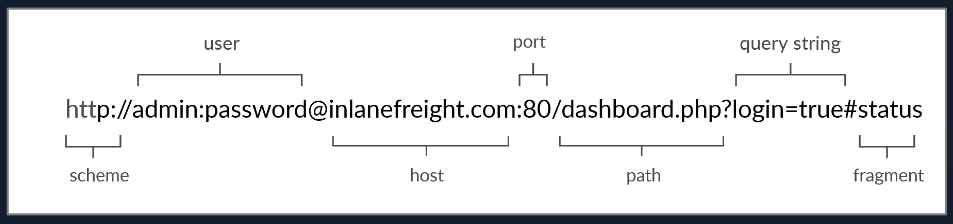

# Web Request (+ API)



Here is what each component stands for:

| **Component** | **Example** | **Description** |
| --- | --- | --- |
| `Scheme` | `http://` `https://` | This is used to identify the protocol being accessed by the client, and ends with a colon and a double slash (`://`) |
| `User Info` | `admin:password@` | This is an optional component that contains the credentials (separated by a colon `:`) used to authenticate to the host, and is separated from the host with an at sign (`@`) |
| `Host` | `inlanefreight.com` | The host signifies the resource location. This can be a hostname or an IP address |
| `Port` | `:80` | The `Port` is separated from the `Host` by a colon (`:`). If no port is specified, `http` schemes default to port `80` and `https` default to port `443` |
| `Path` | `/dashboard.php` | This points to the resource being accessed, which can be a file or a folder. If there is no path specified, the server returns the default index (e.g. `index.html`). |
| `Query String` | `?login=true` | The query string starts with a question mark (`?`), and consists of a parameter (e.g. `login`) and a value (e.g. `true`). Multiple parameters can be separated by an ampersand (`&`). |
| `Fragments` | `#status` | Fragments are processed by the browsers on the client-side to locate sections within the primary resource (e.g. a header or section on the page). |

Not all components are required to access a resource. The main mandatory fields are the scheme and the host, without which the request would have no resource to request.

### HTTPS


Depending on the circumstances, an attacker may be able to perform an HTTP downgrade attack, which downgrades HTTPS communication to HTTP, making the data transferred in clear-text. This is done by setting up a Man-In-The-Middle (MITM) proxy to transfer all traffic through the attacker's host without the user's knowledge. However, most modern browsers, servers, and web applications protect against this attack.

### HTTP Requests


The image above shows an HTTP GET request to the URL:

- `http://inlanefreight.com/users/login.html`

### Headers

Entity Headers:

| **Header** | **Example** | **Description** |
| --- | --- | --- |
| `Content-Type` | `Content-Type: text/html` | Used to describe the type of resource being transferred. The value is automatically added by the browsers on the client-side and returned in the server response. The `charset` field denotes the encoding standard, such as [UTF-8](https://en.wikipedia.org/wiki/UTF-8). |
| `Media-Type` | `Media-Type: application/pdf` | The `media-type` is similar to `Content-Type`, and describes the data being transferred. This header can play a crucial role in making the server interpret our input. The `charset` field may also be used with this header. |
| `Boundary` | `boundary="b4e4fbd93540"` | Acts as a marker to separate content when there is more than one in the same message. For example, within a form data, this boundary gets used as `--b4e4fbd93540` to separate different parts of the form. |
| `Content-Length` | `Content-Length: 385` | Holds the size of the entity being passed. This header is necessary as the server uses it to read data from the message body, and is automatically generated by the browser and tools like cURL. |
| `Content-Encoding` | `Content-Encoding: gzip` | Data can undergo multiple transformations before being passed. For example, large amounts of data can be compressed to reduce the message size. The type of encoding being used should be specified using the `Content-Encoding` header. |

## HTTP Methods

**REQUEST:**

| **Method** | **Description** |
| --- | --- |
| `GET` | Requests a specific resource. Additional data can be passed to the server via query strings in the URL (e.g. `?param=value`). |
| `POST` | Sends data to the server. It can handle multiple types of input, such as text, PDFs, and other forms of binary data. This data is appended in the request body present after the headers. The POST method is commonly used when sending information (e.g. forms/logins) or uploading data to a website, such as images or documents. |
| `HEAD` | Requests the headers that would be returned if a GET request was made to the server. It doesn't return the request body and is usually made to check the response length before downloading resources. |
| `PUT` | Creates new resources on the server. Allowing this method without proper controls can lead to uploading malicious resources. |
| `DELETE` | Deletes an existing resource on the webserver. If not properly secured, can lead to Denial of Service (DoS) by deleting critical files on the web server. |
| `OPTIONS` | Returns information about the server, such as the methods accepted by it. |
| `PATCH` | Applies partial modifications to the resource at the specified location. |

**RESPONSE:**

HTTP status codes are used to tell the client the status of their request. An HTTP server can return five types of response codes:

| **Type** | **Description** |
| --- | --- |
| `1xx` | Provides information and does not affect the processing of the request. |
| `2xx` | Returned when a request succeeds. |
| `3xx` | Returned when the server redirects the client. |
| `4xx` | Signifies improper requests `from the client`. For example, requesting a resource that doesn't exist or requesting a bad format. |
| `5xx` | Returned when there is some problem `with the HTTP server` itself. |

The following are some of the commonly seen examples from each of the above HTTP method types:

| **Code** | **Description** |
| --- | --- |
| `200 OK` | Returned on a successful request, and the response body usually contains the requested resource. |
| `302 Found` | Redirects the client to another URL. For example, redirecting the user to their dashboard after a successful login. |
| `400 Bad Request` | Returned on encountering malformed requests such as requests with missing line terminators. |
| `403 Forbidden` | Signifies that the client doesn't have appropriate access to the resource. It can also be returned when the server detects malicious input from the user. |
| `404 Not Found` | Returned when the client requests a resource that doesn't exist on the server. |
| `500 Internal Server Error` | Returned when the server cannot process the request. |

For a full list of standard HTTP response codes, you can visit this [link](https://developer.mozilla.org/en-US/docs/Web/HTTP/Status). Apart from the standard HTTP codes, various servers and providers such as [Cloudflare](https://support.cloudflare.com/hc/en-us/articles/115003014432-HTTP-Status-Codes) or [AWS](https://docs.aws.amazon.com/AmazonSimpleDB/latest/DeveloperGuide/APIError.html) implement their own codes.

## CRUD API

There are several types of APIs. Many APIs are used to interact with a database, such that we would be able to specify the requested table and the requested row within our API query, and then use an HTTP method to perform the operation needed. For example, for the `api.php` endpoint in our example, if we wanted to update the `city` table in the database, and the row we will be updating has a city name of `london`, then the URL would look something like this:

```bash
curl -X PUT http://<SERVER_IP>:<PORT>/api.php/city/london ...SNIP...
```

APIs perform 4 main operations on the requested database entity:

| **Operation** | **HTTP Method** | **Description** |
| --- | --- | --- |
| `Create` | `POST` | Adds the specified data to the database table |
| `Read` | `GET` | Reads the specified entity from the database table |
| `Update` | `PUT` | Updates the data of the specified database table |
| `Delete` | `DELETE` | Removes the specified row from the database table |

### READ

```bash
DarkSideDani@htb[/htb]$ curl http://<SERVER_IP>:<PORT>/api.php/city/london

[{"city_name":"London","country_name":"(UK)"}]

---- # Formatting JSON with "jq"
DarkSideDani@htb[/htb]$ curl -s http://<SERVER_IP>:<PORT>/api.php/city/london | jq

[
  {
    "city_name": "London",
    "country_name": "(UK)"
  }
]

--- # Searching term and getting matching results:
DarkSideDani@htb[/htb]$ curl -s http://<SERVER_IP>:<PORT>/api.php/city/le | jq

[
  {
    "city_name": "Leeds",
    "country_name": "(UK)"
  },
  {
    "city_name": "Dudley",
    "country_name": "(UK)"
  },
  {
    "city_name": "Leicester",
    "country_name": "(UK)"
  },
  ...SNIP...
]
```

### CREATE

- use HTTP POST request
- if JSON data is used - we should/can also set the `Content-Type` header to JSON

```bash
curl -X POST http://<SERVER_IP>:<PORT>/api.php/city/ -d '{"city_name":"HTB_City", "country_name":"HTB"}' -H 'Content-Type: application/json'
```

To check if it was added:

```bash
curl -s http://<SERVER_IP>:<PORT>/api.php/city/HTB_City | jq

[
  {
    "city_name": "HTB_City",
    "country_name": "HTB"
  }
]
```

### UPDATE

- PUT - used to update API entries and modify their details
- DELETE  - to remove a specific entity

```bash
curl -X PUT http://<SERVER_IP>:<PORT>/api.php/city/london -d '{"city_name":"New_HTB_City", "country_name":"HTB"}' -H 'Content-Type: application/json'
```

We see in the example above that we first specified `/city/london` as our city, and passed a JSON string that contained `"city_name":"New_HTB_City"` in the request data. So, the london city should no longer exist, and a new city with the name `New_HTB_City` should exist. Let's try reading both to confirm:

```bash
┌──(darksidedani㉿darkside)-[~]
└─$ curl -X PUT http://94.237.50.233:58172/api.php/city/london -d '{"city_name":"New_HTB_City", "country_name":"HTB"}' -H 'Content-Type: application/json'
                                                                                                                                                    
┌──(darksidedani㉿darkside)-[~]
└─$ curl -s http://94.237.50.233:58172/api.php/city/london | jq  
[]
                                                                                                                                                    
┌──(darksidedani㉿darkside)-[~]
└─$ curl -s http://94.237.50.233:58172/api.php/city/New_HTB_City | jq
[
  {
    "city_name": "New_HTB_City",
    "country_name": "HTB"
  }
]
```

### DELETE

```bash
curl -X DELETE http://<SERVER_IP>:<PORT>/api.php/city/New_HTB_City

curl -s http://<SERVER_IP>:<PORT>/api.php/city/New_HTB_City | jq
[]
```